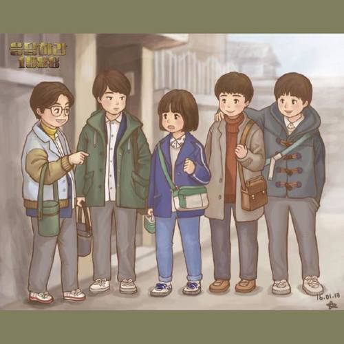

----------------------------------------
----------------------------------------
#  承载童年的游戏机，已停产！但我在 GitHub 找到了它们

[ Github掘金计划 ](javascript:void\(0\);)

**Github掘金计划** 

微信号 GithubStar

功能介绍 用心发掘 Github 和 Gitee 上优质的开源项目。

____

_2021-08-08 11:09_ _发表于_

收录于合集

以下文章来源于HelloGitHub ，作者点击关注→

**HelloGitHub** .

分享 GitHub 上有趣、入门级的开源项目。

那些年，上网用的是电话线，小企鹅也只会笨拙地左右摇晃，手机还只是打电话的工具。虽然那些年没有互联网，但游戏机承载了我的童年。

小时候我老是追着我的两个哥哥，他们带我玩了好多种游戏机，比如街机、红白机、小霸王、世嘉、GBA、PS，现在想想我哥他们应该很烦我，这不就相当于现在的：王者带着小学生打游戏吗？  

后来我长大了，他们也不玩游戏了...

今儿就聊聊童年的那些游戏机，聊聊那些 90 年代的游戏机，虽然现在很多都已停产，但我在 GitHub
找到了这些游戏机的开源模拟器项目，大家还可以下载玩耍，回味童年！

 **"啊哈！小霸王其乐无穷啊！"**

##  任天堂

'
fill='%23FFFFFF'%3E%3Crect x='249' y='126' width='1'
height='1'%3E%3C/rect%3E%3C/g%3E%3C/g%3E%3C/svg%3E)

**红白机** 是任天堂早年发售的一种家庭主机，90 年代初进入中国 FC、NES、小霸王学习机说的都是它。魂斗罗、超级玛丽、坦克大战、雪人兄弟 还有
xxx 合一，多么熟悉的名字。  

'
fill='%23FFFFFF'%3E%3Crect x='249' y='126' width='1'
height='1'%3E%3C/rect%3E%3C/g%3E%3C/g%3E%3C/svg%3E)

> C++：https://github.com/amhndu/SimpleNES
>
> Go：https://github.com/fogleman/nes

'
fill='%23FFFFFF'%3E%3Crect x='249' y='126' width='1'
height='1'%3E%3C/rect%3E%3C/g%3E%3C/g%3E%3C/svg%3E)

我小时候分不清 **世嘉机** 和红白机，我哥不止一次给我讲：“黑色的、能玩《幽游白书》、对打的那个游戏，就是世嘉。”
过几天我依旧会指着红白机喊着要玩《幽游白书》🙄️

'
fill='%23FFFFFF'%3E%3Crect x='249' y='126' width='1'
height='1'%3E%3C/rect%3E%3C/g%3E%3C/g%3E%3C/svg%3E)

> 世嘉：https://github.com/reicast/reicast-emulator

还有个 **Nintendo 64** 这个对于我来说太高级了，我没见过也没玩过但是我找到了图片和模拟器：

'
fill='%23FFFFFF'%3E%3Crect x='249' y='126' width='1'
height='1'%3E%3C/rect%3E%3C/g%3E%3C/g%3E%3C/svg%3E)

> Nintendo 64：https://github.com/project64/project64

* * *

上面是连着电视玩的主机，下面是不需要电视的掌机！

 **GameBoy** 是任天堂发售的第一代便携式掌上游戏机，下一代掌机为 2001 年推出的 Game Boy
Advance（GBA）我小学时梦寐以求的游戏机！

'
fill='%23FFFFFF'%3E%3Crect x='249' y='126' width='1'
height='1'%3E%3C/rect%3E%3C/g%3E%3C/g%3E%3C/svg%3E)

> Python：https://github.com/Baekalfen/PyBoy
>
> C：https://github.com/mgba-emu/mgba
>
> Go：https://github.com/HFO4/gameboy.live
>
> Java：https://github.com/trekawek/coffee-gb
>
> Swift：https://github.com/gabrieloc/GIOVANNI

'
fill='%23FFFFFF'%3E%3Crect x='249' y='126' width='1'
height='1'%3E%3C/rect%3E%3C/g%3E%3C/g%3E%3C/svg%3E)

## 索尼

'
fill='%23FFFFFF'%3E%3Crect x='249' y='126' width='1'
height='1'%3E%3C/rect%3E%3C/g%3E%3C/g%3E%3C/svg%3E)

**PS（PlayStation）** 是日本索尼公司的著名游戏机系列，已推出的版本有：PS、PSone、PSX、PS2、PSP、PS3 等

'
fill='%23FFFFFF'%3E%3Crect x='249' y='126' width='1'
height='1'%3E%3C/rect%3E%3C/g%3E%3C/g%3E%3C/svg%3E)

> PS1：https://github.com/BluestormDNA/ProjectPSX
>
> PS2：https://github.com/PCSX2/pcsx2
>
> PS3：https://github.com/RPCS3/rpcs3
>
> PS1 for Andorid：https://github.com/stenzek/duckstation

'
fill='%23FFFFFF'%3E%3Crect x='249' y='126' width='1'
height='1'%3E%3C/rect%3E%3C/g%3E%3C/g%3E%3C/svg%3E)

* * *

现在索尼的主机很出名，但它也出过掌机叫做 **PSP（PlayStation Portable）** 当时也是十分流行的。

'
fill='%23FFFFFF'%3E%3Crect x='249' y='126' width='1'
height='1'%3E%3C/rect%3E%3C/g%3E%3C/g%3E%3C/svg%3E)

> PSP：https://github.com/hrydgard/ppsspp

'
fill='%23FFFFFF'%3E%3Crect x='249' y='126' width='1'
height='1'%3E%3C/rect%3E%3C/g%3E%3C/g%3E%3C/svg%3E)

## 微软

'
fill='%23FFFFFF'%3E%3Crect x='249' y='126' width='1'
height='1'%3E%3C/rect%3E%3C/g%3E%3C/g%3E%3C/svg%3E)

**Xbox 360** 让我知道了微软也有游戏机。

> Xbox 360：https://github.com/xenia-project/xenia

'
fill='%23FFFFFF'%3E%3Crect x='249' y='126' width='1'
height='1'%3E%3C/rect%3E%3C/g%3E%3C/g%3E%3C/svg%3E)

## 其它

推荐一个集多种游戏机模拟器的开源项目：OpenEmu

'
fill='%23FFFFFF'%3E%3Crect x='249' y='126' width='1'
height='1'%3E%3C/rect%3E%3C/g%3E%3C/g%3E%3C/svg%3E)

> https://github.com/OpenEmu/OpenEmu

## 最后

游戏机陪我走过了童年，游戏则贯穿我的学生时代。游戏不仅给我带来了快乐，还是社交的媒介，如果没有游戏我就认识不了现在这些哥们儿。我上的初中和高中都是新学校没有认识的同学，后来通过游戏这个兴趣爱好我成功地融入了新环境。

> 游戏无罪，但发行商不能把游戏当成收割财富的镰刀。
>
> 认清虚拟和现实，重要的是享受乐趣和陪你打游戏的人。

当前浏览器不支持播放音乐或语音，请在微信或其他浏览器中播放  惠化洞 音乐： Tenholes蓝调口琴 - 请回答1988

__

我现在很少玩游戏，早已忘记游戏的账号和密码，但我能快速地说出：

  * 我第一台游戏机是：PSP3000（破解版）是我高考完买笔记本，悄悄地降低了电脑配置，用省下的钱买的。
  * 我第一个通关的游戏是：雪人兄弟（双人）是和我高中临铺的哥们儿用手机打通的。

那时候下晚自习，熄灯后我俩就用塞班手机连着蓝牙，玩 FC 模拟器玩到手机没电...

你第一台游戏机是什么？第一个通关的游戏是什么？坐在你身边和你一起通关的那个人是谁？留言告诉大家你的故事。

## 推荐

  * [编程基础](https://mp.weixin.qq.com/mp/appmsgalbum?action=getalbum&album_id=1632585323454971905&__biz=MzIwNDgzMzI3Mg==#wechat_redirect) ：精选编程基础如学习路线、编程语言相关的开源项目。
  * [计算机基础](https://mp.weixin.qq.com/mp/appmsgalbum?action=getalbum&album_id=1635325633234780161&__biz=MzIwNDgzMzI3Mg==#wechat_redirect)：精选计算机基础（操作系统、计算机网络、算法、数据结构）相关的开源项目。
  * [技术面试](https://mp.weixin.qq.com/mp/appmsgalbum?action=getalbum&album_id=1632589980491366403&__biz=MzIwNDgzMzI3Mg==#wechat_redirect) ：精选技术面试相关的开源项目。
  * [项目实战](https://mp.weixin.qq.com/mp/appmsgalbum?action=getalbum&album_id=1632590550748938241&__biz=MzIwNDgzMzI3Mg==#wechat_redirect) ：精选实战类型的开源项目。
  * [神器工具&网站](https://mp.weixin.qq.com/mp/appmsgalbum?__biz=MzIwNDgzMzI3Mg==&action=getalbum&album_id=1692140336665378820#wechat_redirect) : 一些好用的插件、软件、网站。
  * [Java](https://mp.weixin.qq.com/mp/appmsgalbum?action=getalbum&album_id=1345382825083895808&__biz=Mzg2OTA0Njk0OA==#wechat_redirect) ：Java类开源项目汇总

  

  

用心发掘 Github 和 Gitee 上优质的开源项目。

后台回复 **「PDF」** 获取 计算机必读书籍

欢迎关注 **「Github掘金计划」**

  

 ** ** ** ** ************

预览时标签不可点

